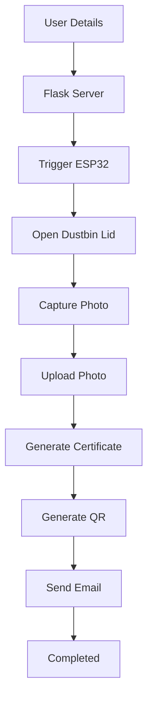

<div align="center">

# ♻️ Smart E-Waste Dustbin System

### *An IoT Powered Smart Recycling Solution using ESP32, Flask & Computer Vision*

<p align="center">
  
  
  
  
  
  
</p>

<p align="center">
  
  
  
</p>

</div>

---

# 📖 About

The **Smart E-Waste Dustbin System** is an IoT-based smart recycling solution designed to encourage responsible disposal of electronic waste.

Users simply enter their details through a web interface, after which the ESP32 automatically opens the dustbin lid. The system captures the user's photo, generates a personalized PDF certificate with a QR code, and emails it instantly. A live dashboard keeps track of the entire process in real time.

---

# ✨ Features

- ♻️ Smart E-Waste Collection
- 📡 ESP32 Controlled Dustbin
- 🔓 Automatic Lid Opening
- 📷 ESP32-CAM Support
- 💻 Webcam Fallback
- 📊 Live Dashboard
- ⚡ Real-Time Updates (SSE)
- 📄 Automatic PDF Certificate
- 🔳 QR Code Generation
- 📧 Email Notification
- 🌱 Daily Recycling Counter
- 📈 Activity Feed
- 📱 Responsive Interface

---

# 🏗 System Architecture

```text
             User
               │
               ▼
        Web Registration
               │
               ▼
         Flask Backend
      ┌────────┴────────┐
      │                 │
      ▼                 ▼
   ESP32           Live Dashboard
      │
      ▼
 Open Dustbin Lid
      │
      ▼
Capture User Photo
      │
      ▼
 Upload to Server
      │
      ▼
Generate QR Code
      │
      ▼
Generate PDF Certificate
      │
      ▼
 Send Email
```

---

# 🚀 Workflow



---

# 🛠 Tech Stack

| Category | Technologies |
|-----------|--------------|
| Backend | Python, Flask |
| Frontend | HTML, CSS, JavaScript |
| Hardware | ESP32, ESP32-CAM |
| Communication | HTTP, REST API |
| Real Time | Server Sent Events |
| PDF | ReportLab |
| QR Code | qrcode |
| Image Processing | Pillow |
| Email | SMTP |

---

# 📂 Folder Structure

```
Smart-EWaste-Dustbin
│
├── server.py
├── certificates/
├── static/
├── templates/
├── uploads/
├── README.md
```

---

# 📡 API Endpoints

| Method | Endpoint | Description |
|----------|----------------|----------------------------|
| GET | / | Web Interface |
| GET | /api/stream | Live Dashboard |
| POST | /api/submit | Submit User Details |
| POST | /api/upload-photo | Upload ESP32 Image |
| POST | /api/test-upload | Upload Webcam Image |
| POST | /api/lid-status | ESP32 Status |

---

# 📊 Dashboard

The dashboard displays

- Live ESP32 Status
- Dustbin Lid Status
- Today's Recycling Count
- Current User
- Activity Feed
- Processing Status
- Last Updated Time

---

# 📄 Generated Certificate

Each certificate contains

- User Name
- Mobile Number
- Email Address
- Date & Time
- Waste Category
- Civic Score
- QR Code
- Certificate Number
- User Photograph
- Verification Status


# ⚙️ Installation

Clone Repository

```bash
git clone https://github.com/yourusername/Smart-EWaste-Dustbin.git
```

Move into Project

```bash
cd Smart-EWaste-Dustbin
```

Install Dependencies

```bash
pip install flask
pip install flask-cors
pip install pillow
pip install reportlab
pip install qrcode
pip install requests
```

Run

```bash
python server.py
```

Open Browser

```
http://localhost:5000
```

---

# ⚙️ Configuration

Update these values inside **server.py**

```python
ESP32_CAM_IP = "YOUR_ESP32_IP"

SENDER_EMAIL = "your_email@gmail.com"

SENDER_PASSWORD = "your_app_password"
```

---

# 🌍 Future Improvements

- AI Waste Classification
- Firebase Integration
- Mobile Application
- Cloud Database
- User Authentication
- Analytics Dashboard
- Admin Panel
- Face Recognition
- Multi Dustbin Support

---

# 🤝 Contributing

Contributions are always welcome.

1. Fork the repository

2. Create your feature branch

```
git checkout -b feature-name
```

3. Commit your changes

```
git commit -m "Added new feature"
```

4. Push

```
git push origin feature-name
```

5. Open a Pull Request

---

<div align="center">

## ⭐ If you found this project useful, don't forget to Star the Repository ⭐

Made with ❤️ for a Cleaner & Greener Future 🌱

</div>
